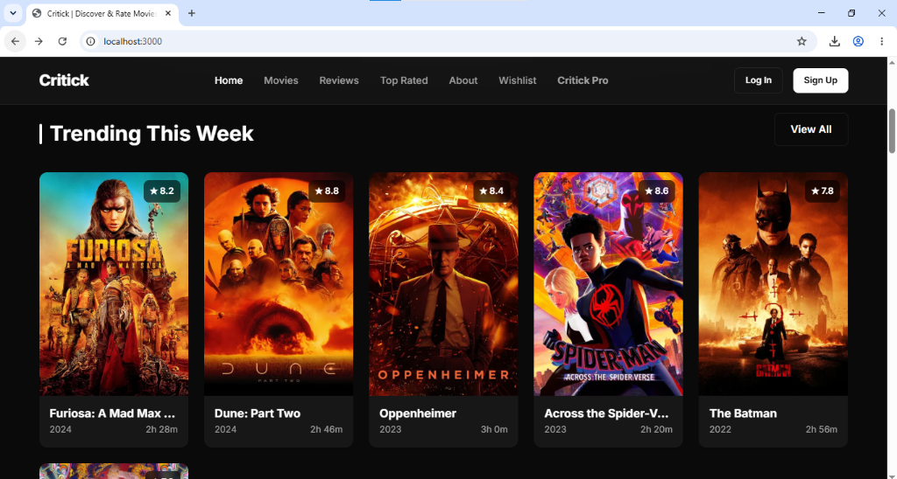
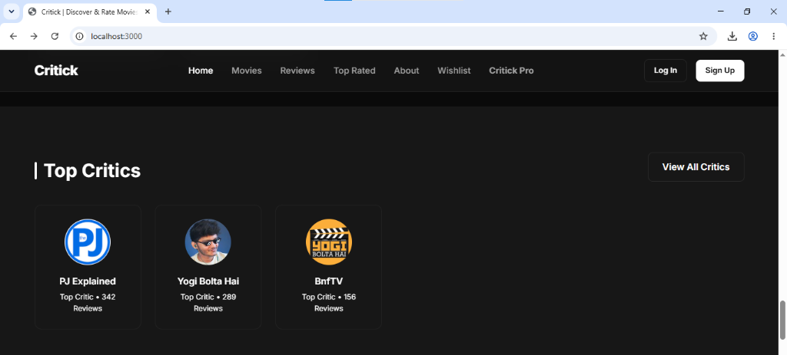
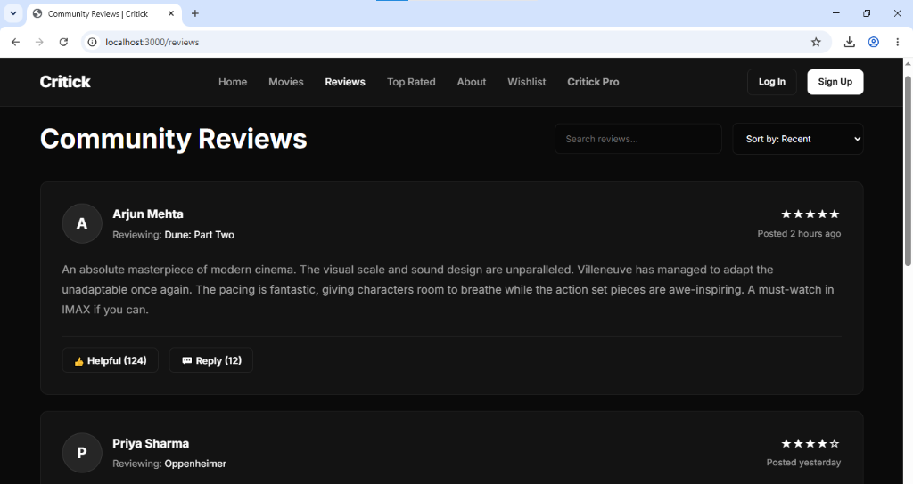

# 🎬 Critick — Movie Review & Rating Website

A Modern, fully responsive Movie Review and Rating platform built with **pure HTML, CSS, and JavaScript**. Critick allows users to discover, review, rate, and track their favorite movies in a sleek, dark - themed Editorial Interface.

---

## 📸 Preview

Here are some previews of the Critick platform:

### Homepage


### Trending This Week


### Top Critics


### Community Reviews


---

## ✨ Features

- **🏠 Homepage** — Hero banner, trending movies, categories, fan favourites, top critics, community reviews, and platform stats.
- **🎥 Movies Catalog** — Browse movies with filter sidebar (genre, year, rating), sorting options, and pagination.
- **📝 Community Reviews** — Read detailed reviews from community members with helpful/reply interactions.
- **🎞️ Movie Details** — Full movie pages with synopsis, rating panel, cast grid (TMDB photos), and user reviews.
- **📋 Wishlist** — Personal watchlist to save movies for later.
- **👤 User Profile** — Profile page with avatar, bio, stats, favourite movies, and activity timeline.
- **🔐 Authentication** — Login and Register forms with validation-ready structure.
- **⭐ Critick Pro** — Premium subscription page with 3-tier pricing (Free/Pro/Critic), billing toggle (monthly/yearly), and FAQ accordion.

---

## 🛠️ Tech Stack

- **HTML5** — Semantic structure, SEO meta tags, accessibility attributes
- **CSS3** — Custom properties, Flexbox, CSS Grid, glassmorphism, keyframe animations, media queries
- **JavaScript (Vanilla)** — Navbar scroll effect, Intersection Observer (scroll animations), billing toggle, FAQ accordion
- **TMDB API (Images)** — Movie poster artwork via `image.tmdb.org` CDN + local fallback images

This project uses **zero JavaScript frameworks or CSS libraries** — it's built entirely with vanilla HTML, CSS, and JS.

---

## 🚀 Getting Started

1. **Clone the repository:**
   ```bash
   git clone https://github.com/rexmantode13/Critick.git
   cd Critick
   ```

2. **Run with a local server** (choose one):
   ```bash
   # Using npx serve (Node.js required)
   npx serve . -l 3000

   # Using Python
   python -m http.server 3000
   ```

3. **Open in browser:** `http://localhost:3000`

*(Or simply double-click `index.html` in your file explorer!)*

---

## 🌐 Deployment

### Vercel
1. Push the project to a GitHub repository.
2. Go to [vercel.com](https://vercel.com) → Import your repo.
3. Vercel auto-detects it as a static site — no configuration needed.
4. Click **Deploy** — your site is live!

---

## 👨‍💻 Developer

**Rex Mantode** — Founder & Full-Stack Developer

Passionate about Cinema ( Marvel ), Gaming and Creativity. Built Critick as a platform where every film lover can find, rate, and talk about the movies they care about.

---

## 📜 License
© 2026 Critick. All rights reserved.
